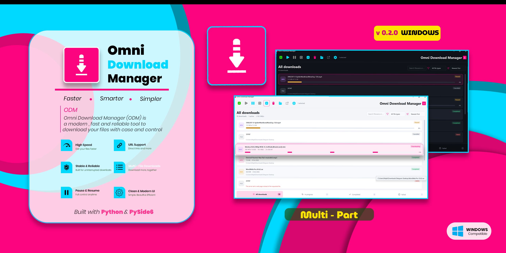
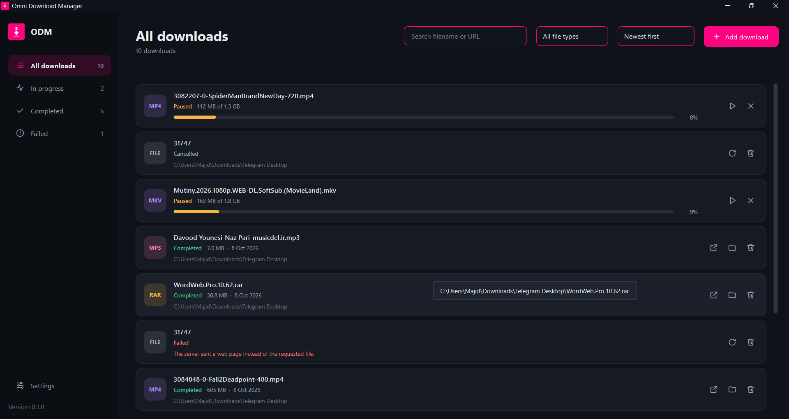
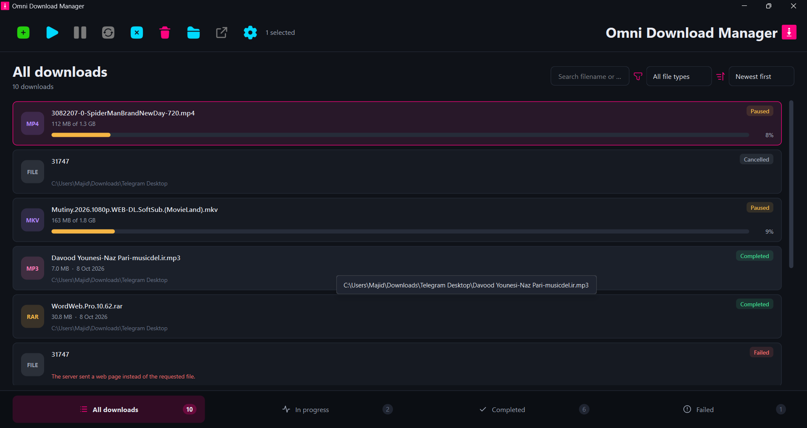

<p align="center">
  
</p>

# Omni Download Manager

<p align="center">
  <strong>A modern, lightweight HTTP/HTTPS download manager for Windows, built with Python and PySide6.</strong><br>
  <strong>یک دانلودمنیجر مدرن و سبک برای دانلودهای HTTP/HTTPS در ویندوز، ساخته‌شده با Python و PySide6.</strong>
</p>

<p align="center">
  <b>Version 0.2.0</b> · <b>Python + PySide6</b> · <b>Portable &amp; Setup builds</b> · <b>142 Tests Passing</b>
</p>

---

## 🇬🇧 English

### Overview

**Omni Download Manager (ODM)** is a desktop download manager built with **Python and PySide6**. It focuses on a reliable core download workflow while providing queue management, pause/resume, retries, scheduling, speed limiting, search, filtering, history, notifications, and a modern dark/light interface.

The project is designed as a modular foundation that can grow into a more capable download-management application without coupling the download engine tightly to the user interface.

### ✨ Highlights

| | Capability | | Capability |
|---|---|---|---|
| ⚡ | HTTP/HTTPS downloads | 🔗 | Adaptive multi-connection downloads |
| ⏯️ | Pause & resume | 🔁 | Automatic retry |
| 🚀 | Up to 5 active downloads | 🐢 | Global speed limit |
| 🗓️ | One-time scheduling | 🔎 | Search & sorting |
| 🗂️ | File categories & filters | ☑️ | Bulk actions |
| 💾 | SQLite download history | 🌓 | Dark & light themes |
| 🔔 | Windows completion notifications | 📦 | Portable Windows build |

### Download engine

- HTTP and HTTPS downloads.
- Streaming downloads directly to disk instead of loading the complete file into memory.
- Automatically uses up to **4 HTTP Range connections** for eligible files when the server returns valid partial responses; otherwise it falls back to a normal download.
- Progress percentage, downloaded/total size, speed, and estimated remaining time when the total size is known.
- Multi-part progress is aggregated from actual bytes and its segment state is persisted for safe resume after pausing or restarting.
- Pause/resume through HTTP `Range` when supported by the server.
- Incomplete downloads are kept as `.part` files so they can be resumed.
- Manual retry plus up to **3 automatic retries** for transient failures, with increasing delays.
- Filename detection from `Content-Disposition` or the URL.
- Existing files are not overwritten; conflicting names are automatically renamed, for example `report (1).pdf`.
- Cancelled downloads remove their partial data, while paused downloads keep it for later resume.

### Queue, scheduling & speed control

- FIFO download queue.
- Up to **5 active downloads** at the same time.
- Optional global download-speed limit shared by active downloads.
- One-time scheduling based on local date/time.
- Scheduled downloads are persisted and can continue after restarting the application.
- Downloads interrupted by closing the application are restored as paused items.

### Download library

- Views for **All Downloads, In Progress, Completed, and Failed**.
- Search by filename or URL.
- Sort by newest, oldest, filename, or file size.
- File-type categories: Archives, Video, Audio, Images, Documents, Programs, and Other.
- Multi-selection with `Ctrl` / `Shift`; a plain click selects one row, and clicking that selected row again clears the selection.
- Bulk pause, resume, cancel, and remove actions.
- Open downloaded files or their containing folders.
- Copy download URLs from the context menu.
- Optional deletion of a completed file from disk when removing its history entry.

### Interface & settings

- Modern **PySide6 / Qt 6** desktop interface.
- Dark and light themes with a pink accent design.
- Windows title-bar integration where supported.
- Configurable default download directory.
- Option to start downloads immediately.
- Confirmation before destructive actions.
- Configurable connection and read timeouts.
- Windows completion notifications, enabled by default.
- Optional system-proxy support, enabled by default.
- Settings are saved automatically.

---

## 🖼️ Screenshots

The gallery below highlights the interface redesign introduced in **v0.2.0**.

<!-- Keep screenshots free of personal usernames, paths, and private filenames. -->
<p align="center">
  <strong>Previous interface</strong>
</p>
<p align="center">
  
</p>

<p align="center">
  <strong>Redesigned interface · v0.2.0</strong>
</p>
<p align="center">
  
</p>

---

## 🛠️ Technology

| Area | Technology |
|---|---|
| Language | Python 3.10+ |
| GUI | PySide6 / Qt 6 |
| HTTP | `requests` |
| Database | SQLite / `sqlite3` |
| Settings | JSON |
| Packaging | PyInstaller |
| Installer | Inno Setup |
| Testing | Python `unittest` |

The runtime dependency set is intentionally small: **PySide6** and **requests** are the main third-party dependencies.

---

## 🚀 Getting Started

### Windows — easiest method

From the project root:

```bat
run.bat
```

The script creates the virtual environment when needed, installs dependencies, and starts the application.

### Manual setup

```bat
py -3 -m venv .venv
.venv\Scripts\activate
python -m pip install -r requirements.txt
python main.py
```

You can also run the package directly:

```bat
python -m omni_download_manager
```

For an editable installation and the `odm` command:

```bat
python -m pip install -e .
odm
```

---

## 📦 Portable Windows Version

ODM is distributed in two ways: a portable folder and a Windows Setup installer.

### Portable

1. Extract the ZIP package completely.
2. Keep the `_internal` folder next to `Omni Download Manager.exe`.
3. Run `Omni Download Manager.exe`.

> **Important:** the portable executable must not be separated from `_internal`.

### Setup installer

The Inno Setup script `omni download manager v 0.2.0.iss` packages the same folder into `installer\Omni-Download-Manager-Setup.exe`. See [Build a Windows Release](#-build-a-windows-release).

---

## 🧪 Testing

Run the complete test suite with:

```bat
python -m unittest discover -s tests -t .
```

The current verified suite contains **142 passing tests**. Coverage includes download behavior, HTTP Range detection and fallback, multi-part transfer integrity and fallback, pause/resume, queue scheduling, retries, shared speed limiting, scheduled starts, restart recovery, event dispatching outside the manager lock, category filtering, system-proxy configuration, search/sorting, list selection and bulk actions, persistence, completion notifications, and icon loading.

Download-related tests use a **local HTTP server**, so they do not depend on an external download service.

---

## 🏗️ Architecture

```text
┌───────────────────────────────┐
│        PySide6 / Qt UI        │
└───────────────┬───────────────┘
                │ Qt events/signals
                â–¼
┌───────────────────────────────┐
│       Download Manager        │
│ queue · retry · scheduling   │
└───────┬───────────────┬───────┘
        │               │
        â–¼               â–¼
┌─────────────────────────┐  ┌──────────────┐
│ Adaptive HTTP Engine    │  │   SQLite     │
│ single / multi-part     │  │ repository   │
└────────────┬────────────┘  └──────────────┘
             │
             â–¼
           Files
```

Main project areas:

```text
omni_download_manager/
├── core/        Domain models, states, errors and file categories
├── engine/      Adaptive HTTP download strategies, segments, speed and filenames
├── storage/     SQLite repository and migrations
├── config/      Paths and application settings
├── services/    Queue, scheduling, retries, workers and orchestration
├── ui/          PySide6 interface, dialogs, views and themes
└── utils/       Formatting, validation, logging and OS integration
```

The download engine is separated from the UI and persistence layers. Worker threads perform downloads independently, while Qt events/signals carry state changes back to the GUI layer.

---

## 💾 Data & Storage

On Windows, the default application-data directory is:

```text
%APPDATA%\Omni Download Manager\
```

Typical contents:

```text
settings.json
downloads.db
logs/
  omni_download_manager.log
```

The location can be overridden with:

```text
ODM_DATA_DIR
```

The project also maintains compatibility with the older `FETCHLY_DATA_DIR` data location during migration.

---

## 🔨 Build a Windows Release

PyInstaller configuration is provided in the project.

```bat
python -m pip install pyinstaller
python scripts\make_icon.py
pyinstaller --noconfirm packaging\omni_download_manager.spec
```

The build produces a folder-based portable application containing the executable and `_internal` directory. The complete output folder should be packaged for distribution.

### Build the Setup installer

With [Inno Setup 6 or 7](https://jrsoftware.org/isinfo.php) installed:

```bat
"C:\Program Files\Inno Setup 7\ISCC.exe" "omni download manager v 0.2.0.iss"
```

The script reads `dist\Omni Download Manager\*` (relative to the repository root, so it works from any checkout) and writes `installer\Omni-Download-Manager-Setup.exe`.

> `dist\` and `installer\` are build output and are excluded from version control. Rebuild the portable folder before compiling the installer so the package contains the current code.

---

## ⚠️ Current Limitations

The project is intentionally focused on its current core feature set. The following are **not implemented yet**:

- FTP downloads.
- BitTorrent support.
- Browser integration for automatically capturing download links.
- Account login, cookies, or configurable custom request headers.
- A dedicated manual-proxy configuration interface; the current option uses the system proxy.
- Resuming a download from a server that refuses HTTP `Range` requests.

---

## 🗺️ Project Status

**Omni Download Manager 0.2.0** adds adaptive multi-connection downloads and a redesigned desktop interface to the existing download workflow.

The architecture is deliberately modular so future versions can extend the transfer layer and application features without requiring a complete rewrite of the UI or storage system.

---

## 🤝 Contributing

Contributions, bug reports, and ideas are welcome. When submitting a change, please keep the existing modular architecture in mind and run the test suite before opening a pull request.

---

## 📄 License

No license has been selected or included yet. Until a license is added, reuse,
modification, and redistribution terms are not defined. Add a license before
describing the project as open source or redistributing it.

---

# 🇮🇷 فارسی

## معرفی

**Omni Download Manager (ODM)** یک دانلودمنیجر دسکتاپ است که با **Python و PySide6** ساخته شده و تمرکز آن روی یک تجربهٔ قابل‌اعتماد برای دانلودهای HTTP/HTTPS است.

این پروژه علاوه بر هستهٔ دانلود، امکاناتی مثل مدیریت صف، مکث و ادامه، تلاش مجدد، زمان‌بندی، محدودیت سرعت، جست‌وجو، مرتب‌سازی، فیلتر دسته‌بندی، تاریخچهٔ دانلود، اعلان و رابط کاربری روشن/تیره را ارائه می‌دهد.

معماری برنامه به‌صورت ماژولار طراحی شده تا بتوان امکانات آینده را بدون وابستگی شدید بین موتور دانلود، رابط کاربری و ذخیره‌سازی اضافه کرد.

## ✨ امکانات اصلی

- دانلود فایل از لینک‌های `HTTP` و `HTTPS`.
- دانلود چنداتصالی خودکار تا **۴ اتصال** برای فایل‌های مناسب و سرورهای دارای پاسخ معتبر `Range`؛ در غیر این صورت ادامه با دانلود معمولی.
- دانلود جریانی و کم‌مصرف از نظر حافظه.
- محاسبهٔ پیشرفت چندبخشی بر اساس مجموع بایت‌ها و نگهداری وضعیت بخش‌ها برای ادامهٔ امن پس از مکث یا اجرای دوباره.
- نمایش درصد پیشرفت، حجم، سرعت و زمان باقی‌مانده در صورت مشخص بودن حجم فایل.
- مکث و ادامهٔ دانلود در صورت پشتیبانی سرور از HTTP `Range`.
- نگهداری فایل‌های ناقص با پسوند `.part`.
- حداکثر **۳ تلاش مجدد خودکار** برای خطاهای موقت.
- صف FIFO با حداکثر **۵ دانلود هم‌زمان**.
- محدودیت سرعت کلی و مشترک بین دانلودها.
- زمان‌بندی یک‌بارهٔ دانلود بر اساس زمان محلی.
- بازیابی دانلودهای ناتمام پس از اجرای مجدد برنامه.
- جست‌وجو بر اساس نام فایل یا URL.
- مرتب‌سازی بر اساس جدیدترین، قدیمی‌ترین، نام و حجم.
- فیلتر دسته‌های فایل شامل آرشیو، ویدئو، صوت، تصویر، سند، برنامه و سایر فایل‌ها.
- انتخاب چندتایی و عملیات گروهی.
- بازکردن فایل یا پوشهٔ دانلود و کپی لینک.
- اعلان تکمیل دانلود در ویندوز.
- پشتیبانی از پروکسی سیستم.
- تم روشن و تاریک با طراحی مدرن.
- ذخیرهٔ تنظیمات و تاریخچهٔ دانلود.

## 🖥️ رابط کاربری و تصاویر

رابط کاربری با **PySide6 / Qt 6** ساخته شده است. در نسخهٔ `0.2.0`، چیدمان ابزارها بازطراحی شده و پیمایش صفحات به نوار پایینی منتقل شده است.

<!-- اسکرین‌شات‌ها نباید نام کاربری ویندوز، مسیرهای شخصی یا نام فایل‌های خصوصی را نمایش دهند. -->
<p align="center">
  <strong>رابط کاربری قبلی</strong>
</p>
<p align="center">
  
</p>

<p align="center">
  <strong>رابط بازطراحی‌شده · نسخهٔ 0.2.0</strong>
</p>
<p align="center">
  
</p>

## 🚀 اجرای پروژه در ویندوز

ساده‌ترین روش:

```bat
run.bat
```

یا به‌صورت دستی:

```bat
py -3 -m venv .venv
.venv\Scripts\activate
python -m pip install -r requirements.txt
python main.py
```

روش جایگزین:

```bat
python -m omni_download_manager
```

## 📦 نسخهٔ Portable

نسخهٔ ویندوزی به دو شکل توزیع می‌شود: پوشهٔ Portable و نصب‌کنندهٔ Setup.

### Portable

بعد از استخراج ZIP، فایل زیر را اجرا کنید:

```text
Omni Download Manager.exe
```

پوشهٔ `_internal` باید در کنار فایل EXE باقی بماند.

### نصب‌کنندهٔ Setup

اسکریپت Inno Setup با نام `omni download manager v 0.2.0.iss` همان پوشه را به فایل `installer\Omni-Download-Manager-Setup.exe` تبدیل می‌کند. جزئیات در بخش [ساخت نسخهٔ ویندوز](#-ساخت-نسخهٔ-ویندوز) آمده است.

## 🧪 تست‌ها

برای اجرای تست‌ها:

```bat
python -m unittest discover -s tests -t .
```

در آخرین اجرای تأییدشده، **هر ۱۴۲ تست با موفقیت پاس شده‌اند**. تست‌ها تشخیص و fallback در HTTP Range، صحت دانلود چندبخشی و fallback آن، مکث/ادامه، صف، retry، زمان‌بندی، بازیابی، انتشار رویدادها خارج از قفل مدیر، فیلتر، جست‌وجو، ذخیره‌سازی، رفتار انتخاب در فهرست و قابلیت‌های مرتبط با رابط کاربری را بررسی می‌کنند.

تست‌های دانلود از یک HTTP server محلی استفاده می‌کنند و به سرویس دانلود خارجی وابسته نیستند.

## 🏗️ معماری

پروژه به بخش‌های مستقلی تقسیم شده است:

- `core` — مدل‌ها، وضعیت‌ها، خطاها و دسته‌بندی فایل‌ها.
- `engine` — راهبردهای تطبیقی دانلود HTTP تک‌اتصالی/چندبخشی، segmentها، اندازه‌گیری سرعت و مدیریت نام فایل.
- `storage` — SQLite و migrationها.
- `config` — مسیرها و تنظیمات.
- `services` — صف، زمان‌بندی، retry، workerها و هماهنگی دانلودها.
- `ui` — رابط PySide6، دیالوگ‌ها، صفحات و تم‌ها.
- `utils` — ابزارهای کمکی، لاگ، اعتبارسنجی و ارتباط با سیستم‌عامل.

دانلودها در worker thread انجام می‌شوند و تغییرات وضعیت از طریق رویدادها و سیگنال‌های Qt به رابط کاربری منتقل می‌شوند.

## 💾 ذخیره‌سازی اطلاعات

در ویندوز، مسیر پیش‌فرض اطلاعات برنامه:

```text
%APPDATA%\Omni Download Manager\
```

اطلاعات اصلی شامل موارد زیر است:

```text
settings.json
downloads.db
logs/
```

مسیر ذخیره‌سازی را می‌توان با متغیر زیر تغییر داد:

```text
ODM_DATA_DIR
```

سازگاری با مسیر قدیمی `FETCHLY_DATA_DIR` نیز برای مهاجرت اطلاعات در نظر گرفته شده است.

## 🔨 ساخت نسخهٔ ویندوز

برای ساخت نسخهٔ Portable با PyInstaller:

```bat
python -m pip install pyinstaller
python scripts\make_icon.py
pyinstaller --noconfirm packaging\omni_download_manager.spec
```

خروجی شامل فایل اجرایی و پوشهٔ `_internal` است و برای توزیع باید کل پوشه بسته‌بندی شود.

### ساخت نصب‌کنندهٔ Setup

با نصب بودن [Inno Setup نسخهٔ ۶ یا ۷](https://jrsoftware.org/isinfo.php):

```bat
"C:\Program Files\Inno Setup 7\ISCC.exe" "omni download manager v 0.2.0.iss"
```

اسکریپت محتوای `dist\Omni Download Manager\*` را می‌خواند (مسیرها نسبی هستند و از هر checkout کار می‌کنند) و خروجی را در `installer\Omni-Download-Manager-Setup.exe` می‌نویسد.

> پوشه‌های `dist\` و `installer\` خروجی build هستند و در کنترل نسخه ثبت نمی‌شوند. پیش از ساخت نصب‌کننده، پوشهٔ Portable را دوباره بسازید تا بسته شامل کد به‌روز باشد.

## ⚠️ محدودیت‌های فعلی

در نسخهٔ `0.2.0` موارد زیر هنوز پیاده‌سازی نشده‌اند:

- دانلود FTP.
- پشتیبانی از BitTorrent.
- اتصال مستقیم به مرورگر برای دریافت خودکار لینک دانلود.
- ورود به حساب، Cookie و Header سفارشی قابل تنظیم.
- رابط مستقل برای تنظیم دستی Proxy.
- ادامهٔ دانلود از سروری که از HTTP `Range` پشتیبانی نمی‌کند.

## 📄 مجوز

فعلاً مجوزی برای پروژه انتخاب یا به مخزن اضافه نشده است. تا زمان اضافه‌شدن فایل
مجوز، شرایط استفادهٔ مجدد، تغییر و بازتوزیع مشخص نیست. پیش از معرفی پروژه به‌عنوان
متن‌باز یا بازتوزیع آن، یک مجوز انتخاب و اضافه کنید.

## 🗺️ وضعیت پروژه

نسخهٔ **0.2.0** با دانلود چنداتصالی تطبیقی و رابط کاربری بازطراحی‌شده، بر پایهٔ هستهٔ پایدار دانلود، مدیریت صف، زمان‌بندی و تاریخچهٔ دائمی ساخته شده است.

ساختار ماژولار پروژه اجازه می‌دهد در نسخه‌های بعدی امکانات بیشتری به موتور دانلود و خود برنامه اضافه شود، بدون اینکه نیاز به بازنویسی کامل رابط کاربری یا سیستم ذخیره‌سازی باشد.

---

<p align="center">
  <strong>Omni Download Manager · v0.2.0</strong><br>
  Built with Python & PySide6 · Made for Windows
</p>

